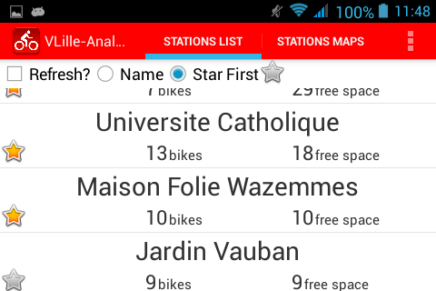
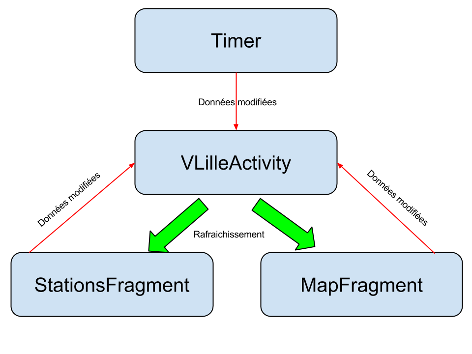

VLille-Analyser
===============

# Vue d'ensemble #

Ce projet est une application Android permettant de visualiser les vélos [VLille (http://www.vlille.fr/)] sur l'ensemble de réseau.  
Ce projet est avant tout un projet étudiant permettant d'appréhender différents aspects du développement d'applications Android; c'est pourquoi l'application n'est pas disponible sur le google play.

## Fonctionnalités ##

Ci dessous l'ensemble des fonctionnalités développés:

 * Recherche de toutes les stations VLille disponible sur le site,
 * Recherche des détails (nombre de vélos disponibles, nombre d'attaches vides) sur une station particulière,
 * rafraichissement automatique des détails toutes les 10 secondes. Ce rafraichissement est activable et désactivable (afin d'économiser des appels réseau par exemple),
 * rafraichissement à la demande d'une station, par simple clic dans la liste,
 * tri des stations:
 	* par identifiant (par défaut),
 	* par nom,
 	* favorites en premier,
 	* n'afficher que les stations favorites.
 * affichage des stations sur la google map, avec rafraichissement automatique lorsque la liste est rafraichi:
 	* rafraichissemnt des détails des stations,
 	* affiche toujours les mêmes stations que la liste (exemple: si vous choisissez de n'afficher que les favoris dans la liste, la map n'affiche que les favoris).
 * affichage des détails d'une station en cliquant sur le marqueur d'une station.

## ScreenShots ##

Ci dessous diférents screenshots montrant les différentes fonctionnalités sur smartphone et tablette. Durant ce projet, différents comportements graphiques ont été étudiés:

 * tabs avec swipes (glisser vers la gauche ou la droite pour afficher différents fragments),
 * affichage des stations sur deux colonnes pour une tablette en mode lanscape (à l'horizontale),
 * ListAdapter permettant d'afficher la liste des stations ainsi qu'un bouton _favoris_ pour chaque item,
 * fragments:
 	* liste des Stations,
 	* MapView,
 	* options de la liste. Ce dernier fragment permet de ne pas duppliquer le code pour les différentes vues smartphone et tablette.

### Smartphone ###
  
  
  
  

### Tablette ###
  
  
  
  
  
  

## Conception ##

### Modèle ###
Le modèle de cette application est répartie en 4 parties:

 * une classe __Station__, qui encapsule simplement les données de chaque station,
 * une __Base de Données__, qui permet de garder en mémoire les stations, ainsi que de trier les données (par nom, favoris en premier, ne garder que les favoris ...),
 * des __AsyncTask__ qui permettent de récupèrer les données en HTTP de manière asynchrone, afin de ne pas pertuber l'interface graphique,
 * un __Timer__ permettant de rafraichir automatiquement la liste des stations toutes les 10 secondes.

Ce modèle est ensuite entièrement géré par l'activité principale _VLilleActivity_, qui s'occupe de répartir correctement les données à travers les différents fragments.

### Vues et Contrôles ###

A chaque action utilisateur, ou à chaque Timer, l'activité principale est donc "prévenue". Elle s'occupe ensuite de gérer les données puis de répartir l'information dans les différents fragments (rafraichissement des stations).

